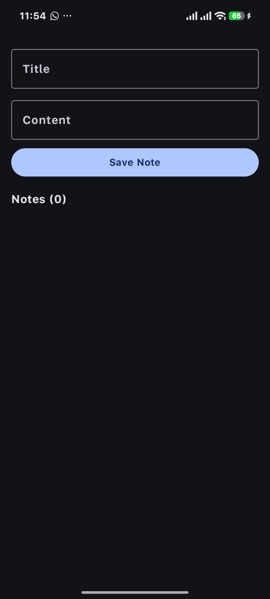
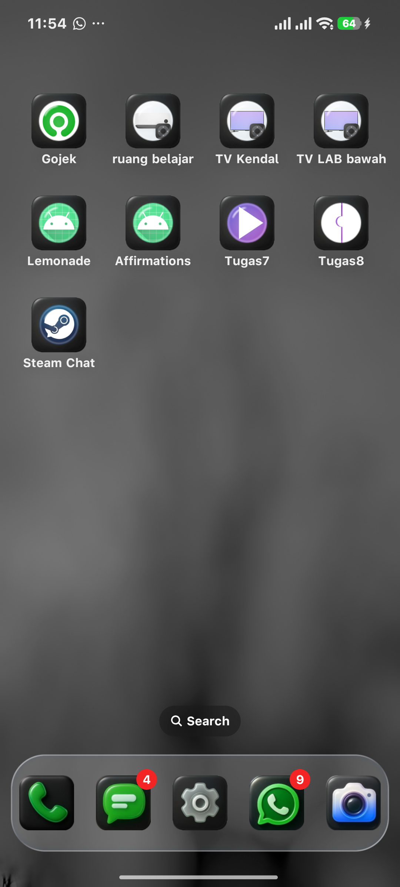

# Tugas9 — Android Persistence dengan Room & Coroutines

Aplikasi Android sederhana untuk menyimpan catatan menggunakan **Room Persistence Library** dan **Kotlin Coroutines** sebagai implementasi pemrograman asinkron.

## Identitas Mahasiswa

| | |
|---|---|
| **NIM** | 452024611053 |
| **Nama** | Farrel Ghozy Affiudin |
| **Kelas** | TI5 A2 |
| **Prodi** | Teknik Informatika |
| **Fakultas** | Sains dan Teknologi |

## Teknologi yang Digunakan

- **Kotlin** 2.2.10
- **Jetpack Compose** — UI deklaratif
- **Room** 2.7.1 — Persistensi database lokal
- **KSP** 2.2.10-2.0.2 — Annotation processing
- **Kotlin Coroutines** — Operasi async di background thread
- **Android Gradle Plugin** 9.1.1

## Struktur Project

```
com.example.tugas9/
├── MainActivity.kt          # Entry point + UI Compose
├── data/
│   ├── Note.kt              # @Entity
│   ├── NoteDao.kt           # @Dao (CRUD + suspend)
│   └── NoteDatabase.kt      # @Database (Singleton)
└── ui/
    ├── theme/               # Tema Material3
    └── viewmodel/
        └── NoteViewModel.kt # ViewModel + viewModelScope
```

## Fitur

- Tambah catatan baru (title + content)
- Tampilkan semua catatan dalam daftar real-time (Flow)
- Update dan hapus catatan
- Database lokal dengan Room (SQLite)
- Operasi database berjalan di `Dispatchers.IO` agar UI tetap responsif

## Cara Menjalankan

1. Buka projekt di **Android Studio**
2. Sync Gradle (**File → Sync Project with Gradle Files**)
3. Hubungkan device Android atau jalankan emulator
4. Klik **Run** (tombol segitiga hijau)

## Screenshot Aplikasi



## Screenshot Hasil Pengujian Database



**Laporan resmi (HTML):** [screenshots/test_report.html](screenshots/test_report.html)

**Detail tiap test:** [screenshots/com.example.tugas9.DatabaseTest.html](screenshots/com.example.tugas9.DatabaseTest.html)

**Output terminal:** [screenshots/test_output.txt](screenshots/test_output.txt)

| Test | Status | Durasi |
|---|---|---|
| `insertAndRetrieve` | ✅ **passed** | 0.001s |
| `insertAndDelete` | ✅ **passed** | 0.160s |
| `insertAndUpdate` | ✅ **passed** | 0.026s |
| **Total** | **3/3 passed** | **0.187s** |

## Mengapa Operasi Database Harus Menggunakan `suspend` dan `Dispatchers.IO`?

Operasi database seperti **insert, read, update, dan delete** adalah **long-running tasks** yang melibatkan akses ke disk (I/O). Jika operasi ini dijalankan di **main thread** (UI thread), maka aplikasi akan terblokir (freeze) hingga operasi selesai, menyebabkan **ANR (Application Not Responding)** dan pengalaman pengguna yang buruk.

### `suspend` Function

Dengan menambahkan keyword **`suspend`** pada fungsi DAO, Room akan menjalankan operasi database di **background thread** secara otomatis melalui Kotlin Coroutines. Fungsi `suspend` dapat dijeda (suspend) tanpa memblokir thread, dan dilanjutkan kembali (resume) setelah operasi selesai.

Contoh:
```kotlin
@Insert
suspend fun insert(note: Note)
```

Tanpa `suspend`, fungsi `insert` harus dijalankan secara sinkron (blocking), yang tidak diperbolehkan oleh Room karena akan menyebabkan error kompilasi.

### `Dispatchers.IO`

**`Dispatchers.IO`** adalah dispatcher coroutine yang dirancang khusus untuk operasi **I/O** seperti baca/tulis database, file, atau network. Dengan menggunakan `viewModelScope.launch(Dispatchers.IO)`, operasi database dikirim ke **thread pool** yang dioptimalkan untuk tugas I/O, sehingga UI thread tetap bebas untuk merender tampilan.

Contoh di ViewModel:
```kotlin
fun saveNote(title: String, content: String) {
    viewModelScope.launch(Dispatchers.IO) {
        noteDao.insert(Note(title = title, content = content))
    }
}
```

### Ringkasan

| Alasan | Penjelasan |
|---|---|
| **Mencegah ANR** | Operasi database tidak memblokir UI thread |
| **Efisiensi thread** | Dispatchers.IO menggunakan thread pool khusus I/O |
| **Kode sekuensial** | Coroutines memungkinkan penulisan kode async secara linear |
| **Keamanan** | Room mewajibkan operasi database di background thread |

## Pengujian

Jalankan instrumented test untuk memvalidasi operasi database:

```bash
./gradlew connectedAndroidTest
```

Test mencakup:
- ✅ Insert dan retrieve data
- ✅ Insert dan delete data
- ✅ Insert dan update data
